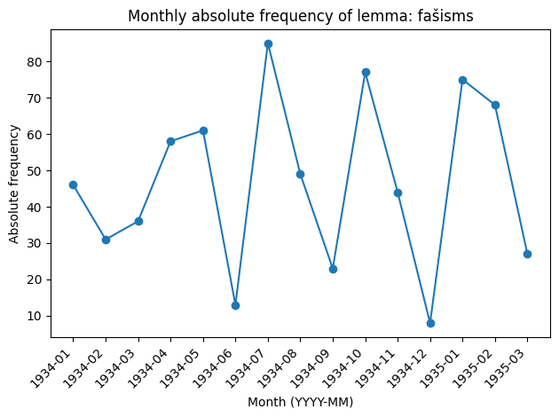
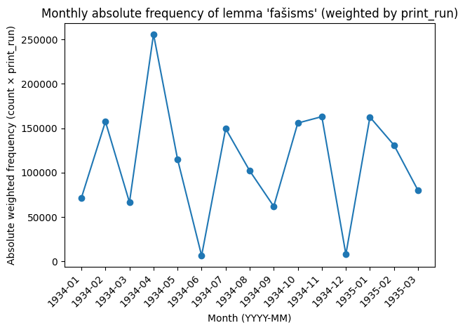
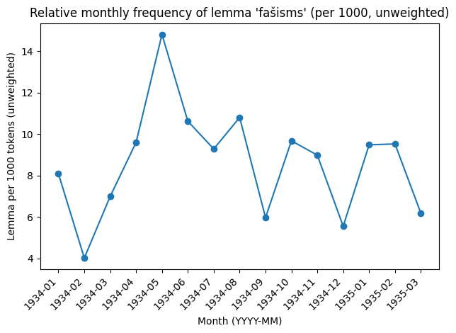
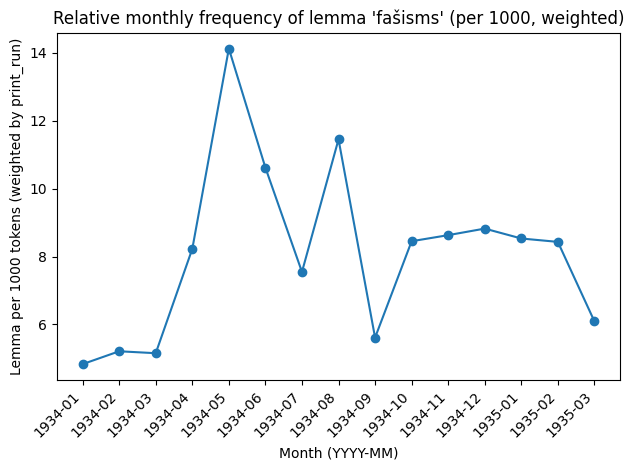

# Latvian Communist Leaflet Corpus (1934–1940)

## About the Project

The **`latvian-communist-leaflet-corpus-1934-1940`** is a digital collection of underground agitational materials issued by various communist and pro-communist organizations in Latvia from 1934 to 1940. The project's goal is to create a structured and easily accessible body of texts for use in historical research, linguistic analysis, and Digital Humanities projects.

All texts have been transcribed from the publication:  
`Latvijas KP CK Partijas vēstures institūts — PSKP CK Marksisma-ļeņinisma institūta filiāle, LKP, LKJS un Sarkanās Palīdzības revolucionārās lapiņas: 1920.–1940. 3. daļa (Latvijas Valsts izdevniecība, 1963)`.

---

## Repository Structure

### Main Directories

* **`latvian_communist_leaflets_1934-1940/`**  
  The **finalized corpus** of digitized materials.  
  - Currently includes **149 unique leaflet texts** (with more to be added).  
  - Each file represents a single leaflet.  
  - All texts are enriched with **structured metadata** for consistent analysis and reuse.  

* **`for_editing/`**  
  Workspace for **transcription and editing**.  
  - Contains `revl-all-LKP_leaflets-1934-1940.docx`, which serves as the staging document.  
  - Draft texts are revised here before being moved into the finalized corpus.  

### File Content

Each text file in the main corpus (`latvian_communist_leaflets_1934-1940/`) follows a consistent structure:

**Metadata**
* **`id`**: The unique serial number for the leaflet.  
* **`file_name`**: The full file name.  
* **`title`**: The title of the leaflet in Latvian, as found in the source.  
* **`author`**: The full name of the organization(s) responsible for the leaflet.  
* **`date`**: The publication date.  
  * Format: `YYYY-MM-DD` (if the exact date is known) or `YYYY-MM` (if only the month and year are known).  
  * Approximate dates use square brackets: `[YYYY-MM-DD...]` (not earlier than the specified date) or `[...YYYY-MM-DD]` (not later than the specified date).  
* **`print_run`**: The number of copies printed, as recorded in the source. If unknown, marked as `unk`.  
* **`typography_name`**: The name of the underground printing house, if known.  
* **`source`**: The bibliographic citation for the source.  

**Text Body**
* **`text:`**: The full, transcribed text of the leaflet.

### File Naming Convention

The files in the main corpus are named using a strict format:  
`revl-n<id_number>-<organization_code>-<print_run>-<date>.txt`

* `revl` — Short for *Revolucionārās lapiņas*, indicating the source book.  
* `<id_number>` — A three-digit serial number (e.g., `001`).  
* `<organization_code>` — A code for the issuing organization. A complete list of codes is provided in the `for_editing/` directory.  
* `<print_run>` — Number of printed copies (`unk` if unknown).  
* `<date>` — The date of publication.  

**Example:**  
`revl-n073-LKJS_CK-6000-1934-10-10.txt`

---

## Analysis notebooks (Colab-ready)

### Absolute frequency
 | [source (.ipynb)](lemma_frequency_notebooks/corpus_monthly_absolute_freq_lemma_unweighted_and_weighted_by_print_run.ipynb)  
*Monthly absolute counts (raw) and print_run-weighted (hits × copies).*

### Relative frequency
 | [source (.ipynb)](lemma_frequency_notebooks/corpus_monthly_relative_freq_lemma_unweighted_and_weighted_by_print_run.ipynb)  
*Monthly relative frequency per 1,000 tokens (unweighted and print_run-weighted; configurable default for unknown runs).*

### Quick start
1. Open a notebook (links above).
2. Upload a ZIP with leaflet `.txt` files.
3. Set `target_lemma` and optional `manual_forms`, then run all cells.

## License

This work is licensed under a  
[Creative Commons Attribution 4.0 International License (CC BY 4.0)](https://creativecommons.org/licenses/by/4.0/).

---

## Author

- **Vladislavs Babaņins**

## Example results  
(125 leaflets, lemma group *fašisms* + inflections, `DEFAULT_WEIGHT_FOR_UNK = 500`)

| Absolute frequency (unweighted) | Absolute frequency (weighted by print_run) |
|---------------------------------|--------------------------------------------|
|  |  |

| Relative frequency per 1,000 tokens (unweighted) | Relative frequency per 1,000 tokens (weighted by print_run) |
|--------------------------------------------------|-------------------------------------------------------------|
|  |  |
