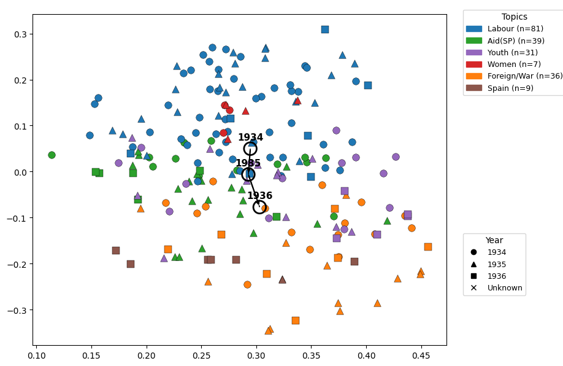
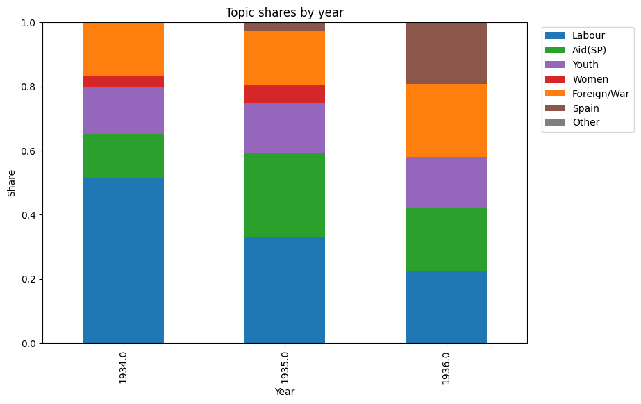
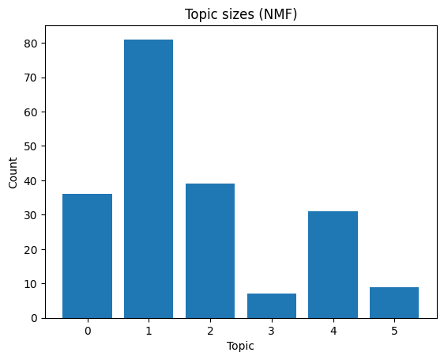
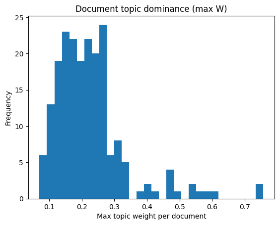

# TF-IDF + NMF Topic Modeling for Latvian Communist Leaflets

Simple notebook using **scikit-learn**, **pandas**, and **matplotlib** for topic modeling (1934–1936).  
ZIP upload → TF-IDF → NMF → visualization.

---

## 📊 2D Topic Map

---

## 📈 Topic Shares by Year

---

## 📦 Topic Sizes

---

## 📉 Topic Dominance

---

### 🧩 Notebook
`leaflet_tfidf_nmf_topic_modeling.ipynb`

### ⚙️ Dependencies
`scikit-learn`, `pandas`, `matplotlib`